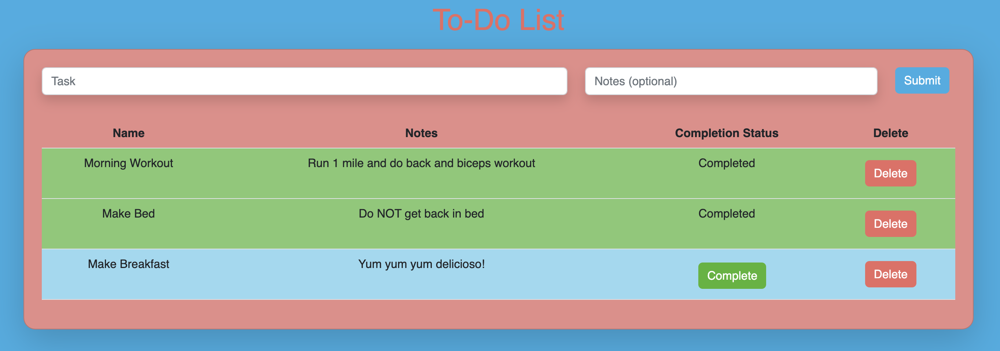

# Full Stack CRUD To-Do List:

## Description

_Duration: 16 hours_

This weekend our goal was to create a fully functional CRUD app that would allow users to create and maintain their personal To-Do List.

To see the fully functional site, please visit: [DEPLOYED VERSION OF APP](www.heroku.com)

## Screen Shot

### Prerequisites

- [Node.js](https://nodejs.org/en/)
- Express 
- Body-Parser
- 'PG'
- Postico

## Installation

1. Clone this repository for your own access.
2. Open up your editor of choice and run an `npm install`
3. Using your preferred database manager - use the provided SQL file to set up the database that tracks your tasks and their status. 
4. Run `node server/server.js` in your terminal
5. Navigate to http://localhost:5000/

## Usage

This application is a way for a user to keep an organized To-Do List to keep track of tasks:
 1. Using the provided inputs - add your task
 3. You can also include notes if you find it necessary
 4. Pressing the submit button adds your input to the "to-do" list
 5. Using the buttons provided - a user can mark a task as "complete" or delete it entirely from the To-Do List.

## License
[MIT](https://choosealicense.com/licenses/mit/)

## Acknowledgement
Thanks to [Prime Digital Academy](www.primeacademy.io) who equipped and helped me to make this application a reality. (Thank your people)